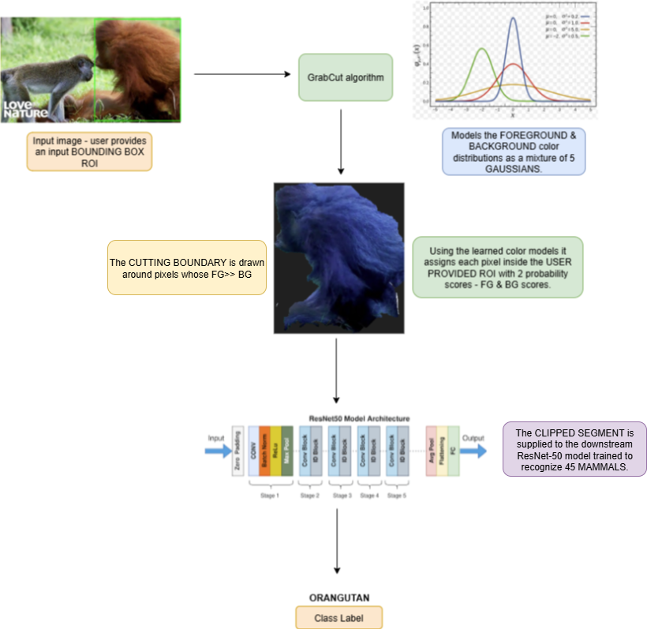

# 🐒🐘🐂GrabCut-ResNet50-For-Interactive-Mammal-Segmentation-And-Recognition🤖

This repo demonstrates that for interactive/guided segmentation, the GrabCut algorithm based on Probabilistic Graphical Models is a computationally cheaper alternative compared to other neural network based models trained for the same task. After GrabCut is used to interactively segment a mammal from a scene, ResNet-50 is used to recognise it.

# Demo 👇
<video src="demo.mp4" controls width="640"></video>
[[Link to Demo]](https://youtu.be/OfJX4Zb534g "Click to watch")

# Overview of the pipeline


## 🚀 Features

* **GrabCut for Interactive Segmentation**: A **Gaussian Mixture Model** based probabilistic algorithm for **interactive object segmentation**.
* **ResNet-50 for Multi-Class classification among 45 mammals**: **Transfer Learning** was used to obtain a validation accuracy of **95.6%**.
* **Streamlit based Interactive Web-UI**: For **demo** purposes.
---

## 📂 Project Structure

```bash
.
├── model_input/                   # The cache where the GrabCut segmented result is stored for downstream ResNet-50 inference.
       ├── input_crop.png # the cropped segment that ResNet-50 infers on.
├── test_images/                   # Some test images to test the interactive mammal recognition pipeline.
       ├── seg_test1.png
       ├── seg_test2.png
       ├── seg_test3.png
├── requirements.txt      # Python dependencies.
├── app_pipeline.ipynb     # Code that runs the entire pipeline: i/p --> GrabCut segmentation --> ResNet-50 inference.
├── resnet_50_finetune.ipynb  # Code that finetunes ResNet-50 on 45 mammal classes using Transfer Learning.
├── app.py            # A Streamlit demo of the entire project.
├── segmentation_utils.py   # Some utility functions that enables mammal segment region generation & caching via. GrabCut from the user supplied ROI bounding box.
├── resnet_50_inference.py   # Code that takes care of downstream mammal label prediction post GrabCut segmentation.
├── labels.txt   # class labels for the dataset which the model should be finetuned on.
├── 95.6_val_acc.pth # Post Transfer Learning ResNet-50 weights file.
```

## 🔧 Running Dependency

Download the weights file **95.6_val_acc.pth** from the link [[Link to download]](https://drive.google.com/file/d/1y_RDATb1K807lt3YiEYhinaH1e2-niSd/view?usp=drive_link).

Place this file inside your project directory.

   ```bash
   ├── dir/
       ├── resnet_50_inference.py.dat
       ├── segmentation_utils.py
       ├── 95.6_val_acc.pth # weights file in the same project directory as the other files.
   ```

## 📜 License

This project is licensed under the [MIT License](LICENSE).

---

## 🙌 Acknowledgements

* [ResNet-50](https://arxiv.org/abs/1512.03385) - The ResNet-50 **Research Paper** which emphasized the use of **Residual/Skip Connection** blocks which yields tremendous performance benifits without **overfitting**.
* [Special Thanks](https://github.com/jiviteshjain/grabcut) - Another repo that contains a clean implementation of using the **GrabCut Algorithm** from scratch.
---

### ⭐ If you find this project helpful, don’t forget to star the repo!
